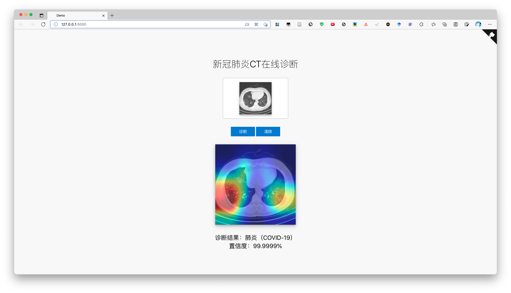
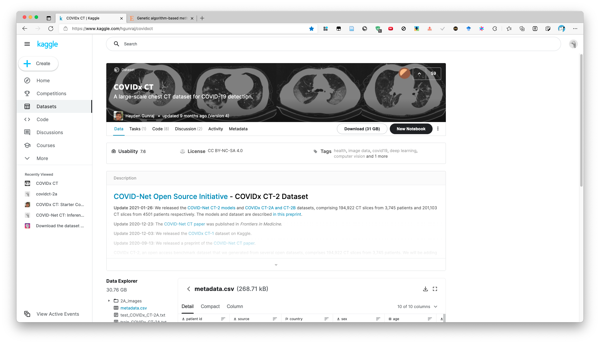
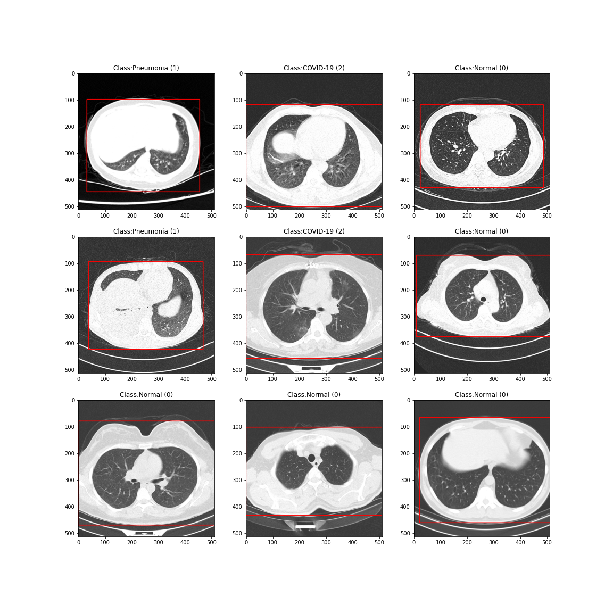
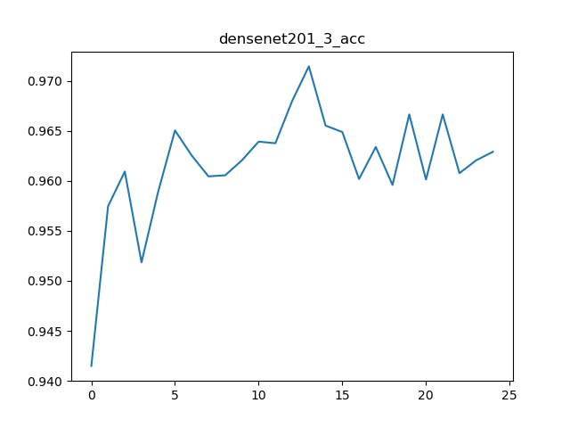
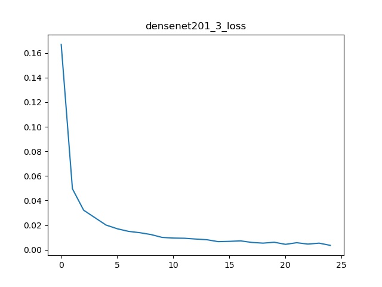

# 基于CNN的2019-nCov新冠肺炎检测鉴定云平台

- 使用DenseNet网络进行迁移学习，构建新冠肺炎CT影像检测模型。


- 使用GradCam++算法对类激活图进行可视化，了解神经网络决策依据。


- 基于 [keras-flask-deploy-webapp](https://github.com/mtobeiyf/keras-flask-deploy-webapp) 的Flask框架部署网络检测平台。



------------------

## Deploy Pytorch Model with Flask as Web App

```shell
# 1. First, clone the repo
$ git clone git@github.com:lxy764139720/covid_web.git

$ cd covid_web

# 2. Install Python packages
$ pip install -r requirements.txt

# please note the torchcam package needs to be installed separately
# for more details, see https://github.com/frgfm/torch-cam/issues/72#issuecomment-943168322
$ pip install git+https://github.com/frgfm/torch-cam.git#egg=torchcam

# 3. Run!
$ python app.py
```

Open http://localhost:5000 and have fun. :smiley:

------------------

## Run with Docker

With **[Docker](https://www.docker.com)**, you can quickly build and run the entire application in minutes :whale:

```shell
# 1. First, clone the repo
$ git clone git@github.com:lxy764139720/covid_web.git
$ cd covid_web

# 2. Build Docker image
$ docker build -t covid_web .

# 3. Run!
$ docker run -it --rm -p 5000:5000 keras_flask_app
```

Open http://localhost:5000 and wait till the webpage is loaded.

------------------

## Dataset - [COVIDx CT](https://www.kaggle.com/hgunraj/covidxct)





## Model

The model training file is [COVID-19.ipynb](./COVID-19.ipynb).

## Performance






## More resources

[Building a simple Keras + deep learning REST API](https://blog.keras.io/building-a-simple-keras-deep-learning-rest-api.html)
